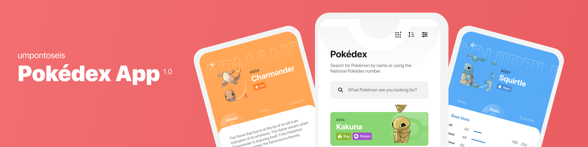
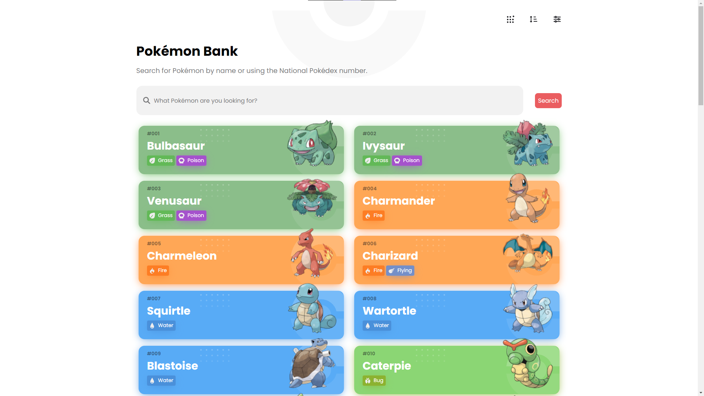
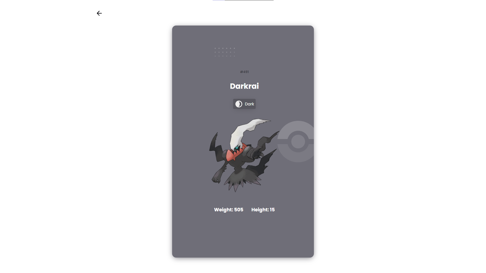
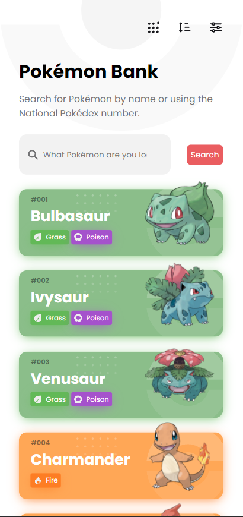
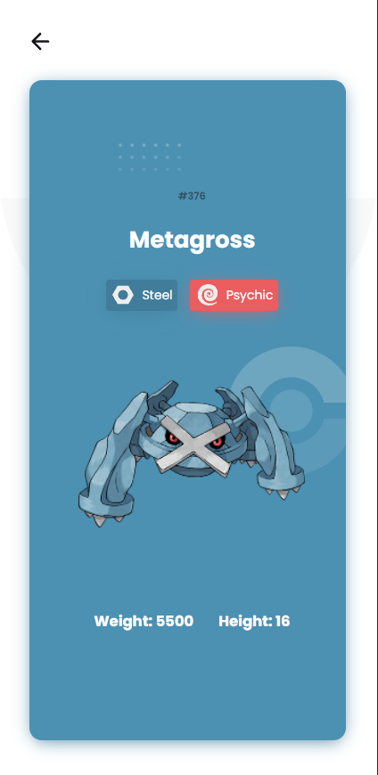

## 📝 Sobre
Um dos projetos que mais gostei de trabalhar e quis trabalhar com várias ferramentas que ando estudando, o PokémonBank é uma pokédex do Pokémon, utilizando a [PokeApi](https://pokeapi.co/docs/v2) onde temos diversas informações sobre vários Pokémon e todo o seu universo.

Feito no intuito de práticar minhas técnicas com chamadas de API e também para trabalhar com um design já fornecido pela página do [DevChallenge](https://www.devchallenge.com.br), construido pela [umpontoseis](https://www.linkedin.com/company/umpontoseis/), e também praticar as linguagens que ando mais utilizando.

Com esse projeto pude me aprofundar em conhecimentos como:
  - Trabalhar com a `context api` do `React.js`
  - Utilizar os `types` do `Typescript`
    - Juntamento com a funcionalidade de `Pick`, onde podemos pegar tipagens especificas de uma interface já criada
  - Utilização de `CSS Modules com o SASS`
  - Trabalho com hooks do `React.js`
  - Manipulação dinâmica de rotas com o `react-router V6`
  - `Vite` como ferramenta de build do projeto

*Nem todas as funcionalidades estão com seu funcionamento 100%, acabei finalizando as partes que consegui no momento*

## 📸 Imagens
<h3 align="center">Versão Web</h3>

  
  

<h3 align="center">Versão Mobile</h3>

  
  

## 🧰 Tecnologias

  
  
  
  

## 👤 Autor
#### Feito com 🤎 por *[Gabriel Bittencourt Penteado](https://www.linkedin.com/in/gabriel-bittencourt-penteado/)*. Entre em contato! 👋🏽